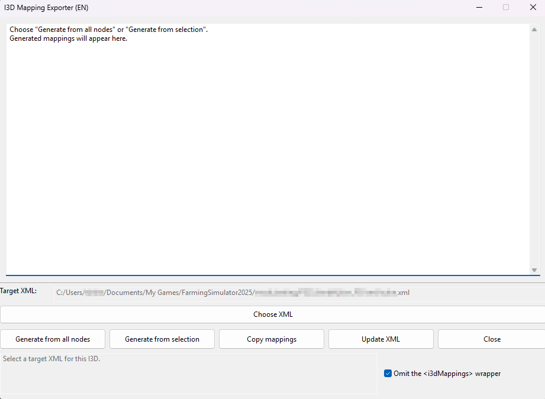

# I3D Mapping Exporter for GIANTS Editor 10.0.X

A GIANTS Editor Lua script that generates i3d mappings from all scene nodes or the active selection, copies the XML to the clipboard, and updates an existing vehicle/placeable XML while preserving its surrounding formatting.

## Notice / Hinweis

The scripts in this repository were created in collaboration with AI. AI assistance was used for implementation, translation, and troubleshooting.

Die Skripte in diesem Repository sind in Zusammenarbeit mit KI entstanden. KI kam bei Implementierung, Übersetzung und Fehlerbehebung zum Einsatz.

## Preview / Vorschau

## Files

- `I3DMappingExporter_DE.lua` — German interface.
- `I3DMappingExporter_EN.lua` — English interface.
- `I3DMappingExporterUpdate.bat` and `I3DMappingExporterUpdate.ps1` — shared helpers for updating an existing XML.
- `BACKUP-I3DMappingExporter.lua` — historical backup; it is not included in the release ZIPs.

## Installation

Download the German or English ZIP from Releases and extract its files together into the GIANTS Editor `scripts` directory. The usual per-user location is `%LOCALAPPDATA%\GIANTS Editor 64bit 10.0.X\scripts`. Restart GIANTS Editor or reload its script list, then choose the matching I3D Mapping Exporter entry from the Scripts menu.

The updater requires Windows PowerShell. It reads mapping elements from the clipboard and updates an existing XML file containing an `<i3dMappings>` section.

## Release packages

Each language ZIP contains that language's Lua script, the shared BAT/PS1 updater files, and a short language-specific installation note.
